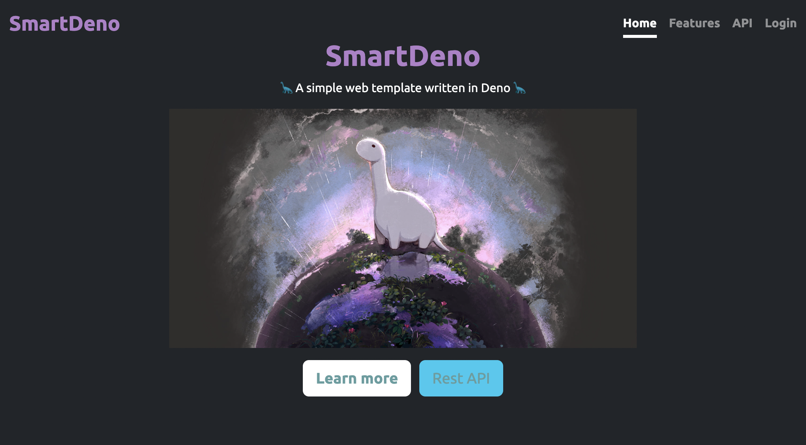

# SmartDeno

**SmartDeno** is a simple Web Template Application written in [TypeScript](https://www.typescriptlang.org/) using [Deno](https://deno.land/).
It is based on the following building blocks:

* [Oak Application Server](https://deno.land/x/oak)
* [Deno KV](https://deno.land/manual@v1.36.4/runtime/kv)
* [Eta Template Engine](https://eta.js.org/)
* [Bootstrap Responsive HTML Library](https://getbootstrap.com/)
* [DyeLog Logger](https://deno.land/x/dyelog@v0.1.1)

## Deno Deploy

This application is compatible with [Deno Deploy](https://deno.com/deploy) and can be visited [here](https://smart-deno-project.deno.dev/)

## Setup

### Cache dependencies locally

    deno cache src/main.ts

## Run

### Locally

    deno task start

### With Docker

    docker build -t smart-deno .
    docker run -p 8000:8000 smart-deno

## Version

Version info is stored in `VERSION` and `/src/version.ts` files.

