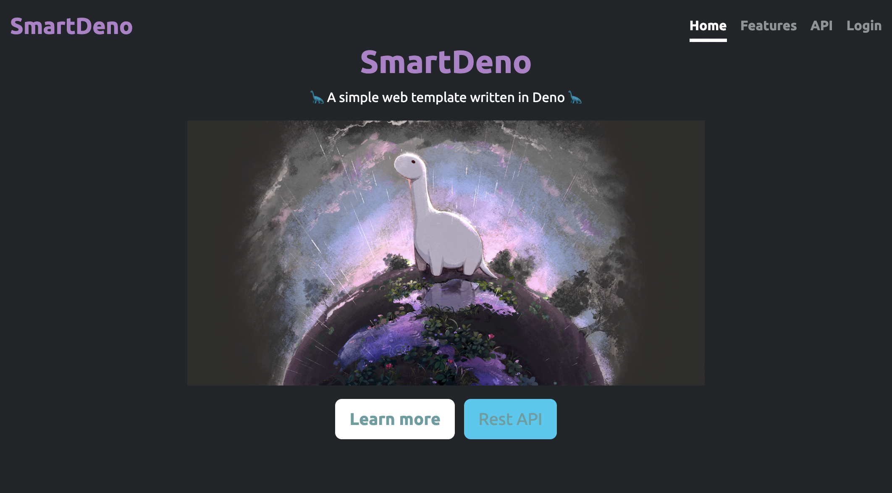

# SmartDeno

**SmartDeno** is a simple Web Template Application written in [TypeScript](https://www.typescriptlang.org/) using [Deno](https://deno.land/).
It is based on the following building blocks:

* [Oak Application Server](https://jsr.io/@oak/oak)
* [Deno KV](https://docs.deno.com/runtime/manual/runtime/kv/)
* [Eta Template Engine](https://eta.js.org/)
* [Bootstrap Responsive HTML Library](https://getbootstrap.com/)
* [DyeLog Logger](https://jsr.io/@littlelite/dyelog)

## Deno Deploy

This application is compatible with [Deno Deploy](https://deno.com/deploy) and can be visited [here](https://smartdeno.guildenstern70.deno.net/)

## Run

### Locally

    deno task start

### With Docker

    docker build -t smart-deno .
    docker run -p 8000:8000 smart-deno

## Version

Version info is stored in `VERSION` and `/src/version.ts` files.

## Containerization

The `Dockerfile` is set up to build a container image for this application. 
It uses the official Deno image as a base, copies the application code, and runs it on port 8000.

To build a Docker image, run:

    docker build --platform linux/amd64 -t smart-deno .

To run the Docker container, use:

    docker run -p 8000:8000 smart-deno

## FAQ

### How can I reset the local KV database?
The local DB database is stored in Deno directory. For instance, on Mac, it is located in

    ./Users/<user>/Library/Caches/deno/location_data

Remove every directory inside `location_data` and restart the application. The database will be recreated.

### When I run the app locally or on Deno Deploy it might complain that it lacks "unstable kv" flag

Deno KV is currently in the process of being stabilized. While it is stable in many environments, some versions or configurations of Deno might still require the `--unstable-kv` flag. If you are running the command manually, ensure you include `--unstable-kv`.

On Deno Deploy, you need to create a Deno KV database in your Deno Deploy console and then assign it to this app.

